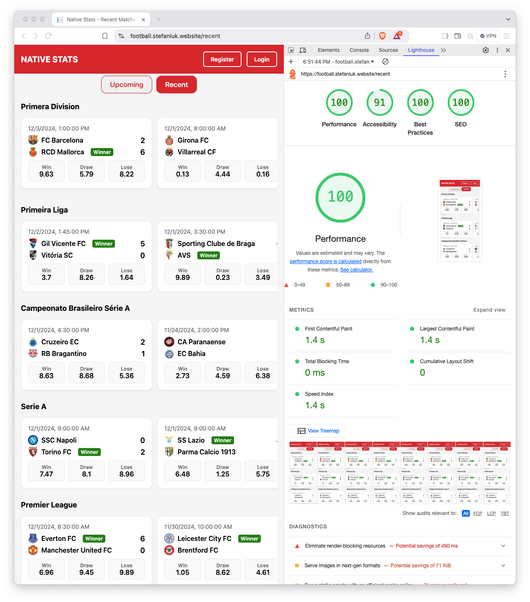

# Football League Matches

Deployed Application: [Football League Matches](https://football.stefaniuk.website/) (https://football.stefaniuk.website/)

Hosting: Digital Ocean Apps (Docker)

Dev environment: 
- IDE: Rider
- Browser: Desktop Safari, Chrome

---

## How to run the project
- Clone the repository
- Open the terminal and navigate to the project folder
- Run `docker-compose -f docker-compose.yml up -d` to start the application
- Open the browser and navigate to `http://localhost:5000`

Project came with preloaded data, but you can refresh the data by:
- Deleting the `app.db` file in the root folder.
- Run the application migration by running `dotnet ef database update` in the terminal.
- Restart the application
- Make `POST` request to `http://localhost:5000/api/maintenance/load-data` to fetch the data from the external service. This request can take a while, because we have 60 seconds delay for each 10 requests to the external service.

---

## Technical Decissions
- Added "Wait-and-Retry" policy for the http client to handle transient errors.
- As my main database I'm using SQLite, one of my favourite database. For this scenario we don't need full-featured separate database server.
- Instead of using "Repository/UoW" patterns, I'm using EF Core database context directly in a services code. I'm not a big fan of repository pattern. Few years ago I wrote a small article about this topic, it's a little bit outdated but still valid [Repository Pattern](https://stefaniuk.website/all/repository-pattern/)
- I decided to store API key inside `docker-compose.yml` instead of environment variables for demo purposes. In real world scenario we must use secrets and environment variables to ensure security.
- Added separate `MatchesController` to act like API for the future mobile application.
    - `GET: https://football.stefaniuk.website/api/recent` - to get recent matches
    - `GET: https://football.stefaniuk.website/api/upcoming` - to get upcoming matches

---

## Possible Improvements
- I'm loading only 45 matches on page. We can introduce infinity scroll to improve user experience.
- We can move external service interaction logic into it's own project inside solution or make it complete separate project like SDK.

## Performance

---